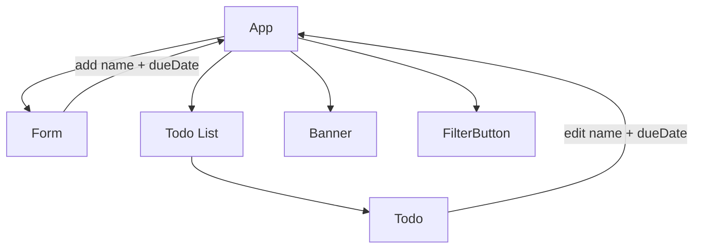
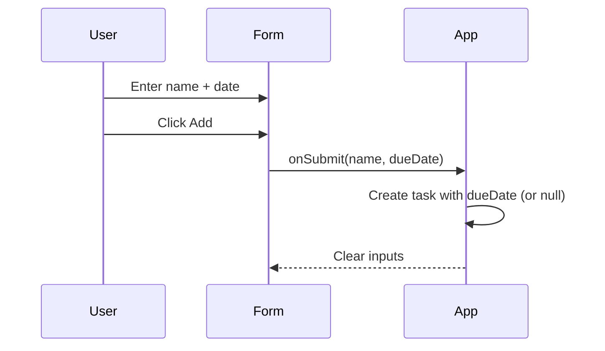

# Architecture: UI Banner, Button Styling, and Due Dates

## Feature summary
This feature bundle adds a small banner region, clarifies button styling, and introduces an optional due date per task.
It targets demo friendliness and quick visual comprehension without changing the core TodoMatic flows.
Primary users are demo viewers and simple task list users; the why is clearer UX and richer task metadata.
Scope stays client-only and incremental within the existing React + Vite structure.

## UI/UX behavior
- Banner: A compact top region visible on all screens containing the app title, a one-line subtitle, and one info item.
- Info item: Total task count.
- Button styling: “Add” and “Save” share a primary visual style; “Delete” remains destructive; filter buttons show a clear selected state.
- Hover states: All buttons provide a hover treatment consistent with their role.
- Due date input: When adding a task, the form includes an optional date input; leaving it empty keeps the task unchanged (no extra UI text).
- Task display: If a due date exists, show it inline in the task item as a date string (e.g., “2026-02-04”). If absent, show nothing.
- Edit flow: The edit UI includes the due date input pre-filled if present; clearing it removes the due date.
- Empty/error states: No new error states are introduced; invalid date input should rely on native date input validation.

## Data model
Task shape extends the existing task object with an optional due date string.
- Proposed shape:
  - `id`: string
  - `name`: string
  - `completed`: boolean
  - `dueDate`: string | null (ISO date `YYYY-MM-DD`)

Examples:
- With due date:
  - `{ id: "todo-1", name: "Pay rent", completed: false, dueDate: "2026-02-10" }`
- Without due date:
  - `{ id: "todo-2", name: "Buy milk", completed: true, dueDate: null }`

## Component impact map
- `src/App.jsx`: Owns task list state; extend task creation and update handlers to carry `dueDate`.
- `src/components/Form.jsx`: Add date input for create flow; pass due date into add handler.
- `src/components/Todo.jsx`: Display due date if present; include due date in edit UI and update handler.
- `src/components/FilterButton.jsx`: Ensure selected state has clear styling and hover treatment.
- `src/main.jsx`: No behavior change expected; only supports app mount.
- `src/index.css`: Centralize button styles (primary, destructive, filter selected, hover) and banner layout styles.

## State & data flow
- Task list state remains in `App` as the single source of truth.
- `Form` emits `name` and optional `dueDate` to `App` via the add callback.
- `Todo` reads its own task props; edit mode emits updated `name` and `dueDate` to `App` via update callback.
- Banner reads derived state from `App` (task count or current filter) and displays it.
- Filter button state remains derived from `App`’s current filter.

Mermaid component diagram:

Mermaid sequence (add task with due date):

## NFR checklist
- Accessibility: Date input has a clear label; button states are visible via color and focus styles; ensure keyboard tab order includes banner controls only if interactive.
- Performance: Minimal derived state; avoid recalculating filters unnecessarily; due date display is simple string rendering.
- Security/Privacy: No sensitive data; if future persistence is added, treat due dates as user-visible and avoid injecting raw HTML.
- Maintainability: Keep task shape stable; centralize button styles in `src/index.css` and reuse class names.

## Implementation steps
1. Add banner UI in `src/App.jsx` with title, subtitle, and selected info item.
2. Extend task model in `App` to include `dueDate` (null when absent).
3. Update `src/components/Form.jsx` to add optional date input and pass it to the add callback.
4. Update `src/components/Todo.jsx` to display due date when present and include date input in edit mode.
5. Update `src/components/FilterButton.jsx` to align with new selected and hover styles.
6. Implement button, banner, and filter styling in `src/index.css` with distinct classes for primary and destructive.
7. Manual verification via `yarn build` + `yarn preview` for add/edit/delete/filter flows and due date display.

## Handoff notes
- Start with task model changes in `App` and ensure existing add/edit flows still work without a due date.
- Implement UI changes incrementally: banner first, then form and todo edits, then styles.
- Risks: Inconsistent date string formatting if inputs are not normalized; recommend storing as `YYYY-MM-DD` from the native date input.
- Assumptions: No persistence layer; no new dependencies; banner info item is non-interactive.

## Open questions
1. Banner info item: total task count.
2. Due date display: date string only (no label prefix).
